# Machine Learning Engineer Nanodegree
## Capstone Project
Shehabul Hossain  
November 25th, 2017

## I. Definition
<!-- _(approx. 1-2 pages)_ -->

### Project Overview
<!-- In this section, look to provide a high-level overview of the project in layman’s terms. Questions to ask yourself when writing this section:
- _Has an overview of the project been provided, such as the problem domain, project origin, and related datasets or input data?_
- _Has enough background information been given so that an uninformed reader would understand the problem domain and following problem statement?_ -->

Image classification has been playing a vital role in Computer Vision. As computers are getting better and with more computational power, computer vision has also improved significantly. AI and Machine Learning has also played a vital role in computer vision. Identifying objects in an image, extracting information from text in an image, describe the whole image has become reality. 

In this project, I created an iceberg classifier that can detect if an image that was taken from satellite has iceberg in it or not. This system takes an images as in input and returns the probability of the image containing an iceberg. A similar study can be found by C. Bentes, A. Frost, D. Velotto and B. Tings titled "Ship-Iceberg Discrimination with Convolutional Neural Networks in High Resolution SAR Images,"[^footnote]. Here, a Convolutional Neural Network has been used for Ship-Iceberg discrimination with high resolution Synthetic Aperture Radar images. 

[^footnote]: C. Bentes, A. Frost, D. Velotto and B. Tings, "Ship-Iceberg Discrimination with Convolutional Neural Networks in High Resolution SAR Images," Proceedings of EUSAR 2016: 11th European Conference on Synthetic Aperture Radar, Hamburg, Germany, 2016, pp. 1-4.
URL: http://ieeexplore.ieee.org/abstract/document/7559347/

### Problem Statement
<!-- In this section, you will want to clearly define the problem that you are trying to solve, including the strategy (outline of tasks) you will use to achieve the desired solution. You should also thoroughly discuss what the intended solution will be for this problem. Questions to ask yourself when writing this section:
- _Is the problem statement clearly defined? Will the reader understand what you are expecting to solve?_
- _Have you thoroughly discussed how you will attempt to solve the problem?_
- _Is an anticipated solution clearly defined? Will the reader understand what results you are looking for?_ -->

Drifting icebergs are one kind of threat to navigation and activities in offshore areas. It can do serious damage to passing ships. Many companies use aerial reconnaissance and shore-based support to monitor environmental conditions and assess risks from icebergs. However, in harsh weather conditions, the only way is to monitor using satellite. Still, the data has to be processed manually in order to differentiate icebergs from other objects like a ship. It is a very tedious job to classify icebergs using satellite signals. To solve this problem machine learning can be used. The satellite collects data as an image and the objective is to create an image classifier that can find icebergs in images. A CNN can be used in this case as CNN's are very good at classifying images. The CNN model will take an image as an input and look for icebergs in that image. The output will be a number between 0 and 1 which will prepresent the probability that the image contains an iceberg.

### Metrics
<!-- In this section, you will need to clearly define the metrics or calculations you will use to measure performance of a model or result in your project. These calculations and metrics should be justified based on the characteristics of the problem and problem domain. Questions to ask yourself when writing this section:
- _Are the metrics you’ve chosen to measure the performance of your models clearly discussed and defined?_
- _Have you provided reasonable justification for the metrics chosen based on the problem and solution?_ -->

The results will be evaluated on the log loss between the predicted values and the ground truth. For each image in the test data there will be a predicted value from 0 to 1 which will represent the probability of the image containing an iceberg. 

In multi-class version of the log loss metric at each observation is in one class and for each observation there is a output probability for each class. The metric is negative the log likelihood of the model that says each test observation is chosen independently from a distribution that places the submitted probability mass on the corresponding class, for each observation.

$$log loss = -\frac{1}{N}\sum_{i=1}^N\sum_{j=1}^My_{i,j}\log(p_{i,j})$$

where N is the number of observations, M is the number of class labels, $log$ is the natural logarithm, $y_{i,j}$ is 1 if observation $i$ is in class $j$ and 0 otherwise, and $p_{i,j}$ is the predicted probability that observation $i$ is in class $j$.

Finally, we will get the validation accuracy that will tell us the percentage of images that are being predicted correctly.
 
Log Loss quantifies the accuracy of a classifier by penalizing false classifications. Minimising the Log Loss is basically equivalent to maximising the accuracy of the classifier, but the classifier must assign a probability to each class rather than simply yielding the most likely class. In simple words, log loss measures the uncertainty of the probabilities of the model by comparing them to the true labels. In this case as out classifier yields the probability of an image containing icebergs, Log Loss is a very good choice of metrics.
## II. Analysis
<!-- _(approx. 2-4 pages)_ -->

### Data Exploration
<!-- In this section, you will be expected to analyze the data you are using for the problem. This data can either be in the form of a dataset (or datasets), input data (or input files), or even an environment. The type of data should be thoroughly described and, if possible, have basic statistics and information presented (such as discussion of input features or defining characteristics about the input or environment). Any abnormalities or interesting qualities about the data that may need to be addressed have been identified (such as features that need to be transformed or the possibility of outliers). Questions to ask yourself when writing this section:
- _If a dataset is present for this problem, have you thoroughly discussed certain features about the dataset? Has a data sample been provided to the reader?_
- _If a dataset is present for this problem, are statistics about the dataset calculated and reported? Have any relevant results from this calculation been discussed?_
- _If a dataset is **not** present for this problem, has discussion been made about the input space or input data for your problem?_
- _Are there any abnormalities or characteristics about the input space or dataset that need to be addressed? (categorical variables, missing values, outliers, etc.)_ -->

Statoil, an international energy company operating worldwide, has worked closely with companies like C-CORE. C-CORE has been using satellite data for over 30 years and has built a computer vision based surveillance system. To keep operations safe an efficient a more efficient system can be implemented using machine learning. The company released the data in a Kaggle competition to find an efficient solution using machine learning. 

The satellites that are used to detect icebergs are 600 kilometers above the earth using a radar that bounces a signal off an object and records the echo, then the data is translated into an image. The C-Band radar operates at a frequency that can see through darkness, rain, cloud and even fog. Echos from different objects are recorded and then translated into an image. An object will appear as a bright spot because it reflects more radar energy than its surroundings, but strong echoes can come from anything solid - land, islands, sea ice, as well as icebergs and ships. The energy reflected back to the radar is referred to as backscatter. Many things include winds affect the backscatter. High winds generate a brighter background and low winds generate darker. The Sentinel-1 satellite is a side-looking radar, which means it sees the image area at an angle (incidence angle). Generally, the ocean background will be darker at a higher incidence angle. You also need to consider the radar polarization, which is how the radar transmits and receives the energy. More advanced radars like Sentinel-1 can transmit and receive in the horizontal and vertical plane. Using this, you can get what is called a dual-polarization image.

Here, we have data with two channels: HH(transmit/received horizontally) and HV(transmit horizontally and received vertically). This can play an important role in classifying1 as different objects tend to reflect energy differently. All the images are 75x75 images with two bands and we also have inc_angel which incidence the angel of which the image was taken. 

We have two data files (train.json, test.json). The files consist of a list of images and for each image, we have the following fields:

- id - the id of the image
- band_1, band_2 - the flattened image data. Each band has 75x75 pixel values in the list, so the list has 5625 elements. Note that these values are not the normal non-negative integers in image files since they have physical meanings - these are float numbers with unit being dB. Band 1 and Band 2 are signals characterized by radar backscatter produced from different polarizations at a particular incidence angle. The polarizations correspond to HH (transmit/receive horizontally) and HV (transmit horizontally and receive vertically).
- inc_angle - the incidence angle of which the image was taken. This field has some missing data marked as "na", and those images with "na" incidence angles are all in the training data to prevent leakage.
- is_iceberg - the target variable, set to 1 if it is an iceberg, and 0 if it is a ship. This field only exists in train.json. The train.json has 1604 rows and the test.json has 8424 rows.

Let's have a look at the distribution of the bands for both iceberg and non-icebergs in train data.
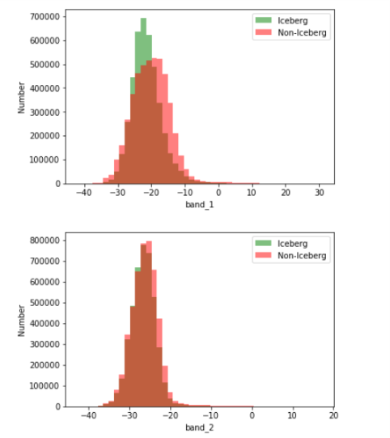

<i>Distribution of values in both band 1 and band 2 for iceberg and non-iceberg objects</i>
  

<i>-</i>
  
We can see that most of the values for band 1 lies between -35 to -10 and for band 2 it is between -35 to -20.  

Let's look at the label distribution.  

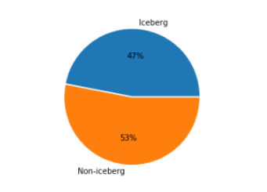

<i>Distribution of labels</i>
  

<i>-</i>
  

We can see that 47% of the images in the train data is labeled as iceberg and the rest 53% are labeled as non-icebergs.

### Exploratory Visualization
<!-- In this section, you will need to provide some form of visualization that summarizes or extracts a relevant characteristic or feature about the data. The visualization should adequately support the data being used. Discuss why this visualization was chosen and how it is relevant. Questions to ask yourself when writing this section:
- _Have you visualized a relevant characteristic or feature about the dataset or input data?_
- _Is the visualization thoroughly analyzed and discussed?_
- _If a plot is provided, are the axes, title, and datum clearly defined?_ -->
As we have described the data that every image in the dataset has 5625 pixels in each band, we will look more in those features and plot them as an image to get a better understanding of the dataset. 

First of all, we take 18 random images from the train data where 9 of them are images of non-icebergs and rest 9 are images of icebergs. Then, we reshape both band\_1 and band\_2 array into 75x75 numpy array and then we plot them to get a better understanding.

##### Images of Iceberg
Let's plot images of iceberg first. We took band_1 for those 9 iceberg images and then plotted to see how they look. The plot looks like following.

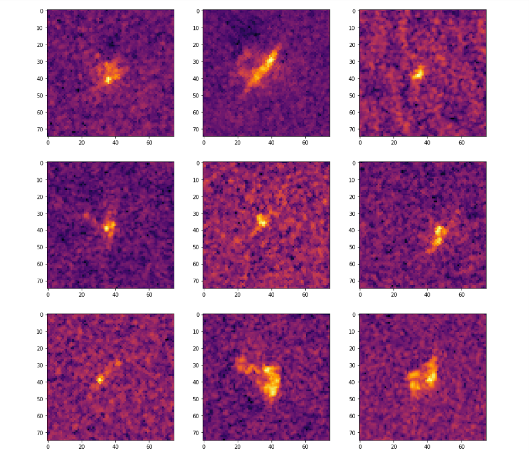

<i>Image of Icebergs from Band_1</i>
  

<i>-</i>
  

We can clearly see those images has a yellowish object in the center. As these images are labeled as icebergs, we can say those objects are actually iceberg.

Let's plot the same images for band_2.   

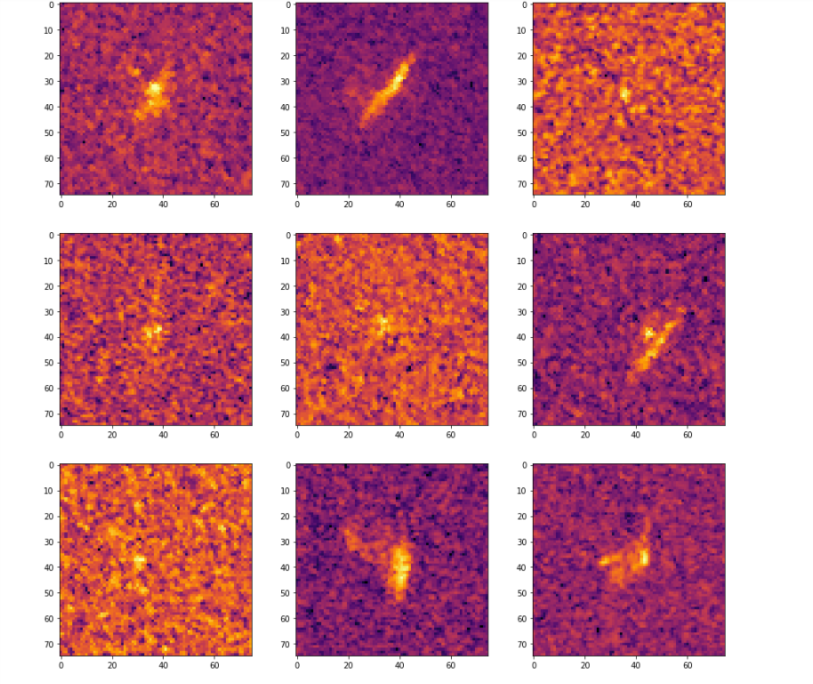

<i>Image of Icebergs from Band_2</i>
  

<i>-</i>
 

In this case, we see the same object in the center, however, in some cases, the noise in the background is too high. 

Now, let's plot some images of **non-icebergs**. We take the same approach as before to take 9 random images of non-icebergs from train data and then plot them for both band\_1 and band\_2.

For band_1 the plot looks like following.  

<i>Image of non-icebergs from Band_1</i>
  

<i>-</i>

In this case, we see 9 images of non-icebergs. We can identify most of them as non-icebergs however, some of them are hard to distinguish even for humans.

For band_2 the plot looks like following.  
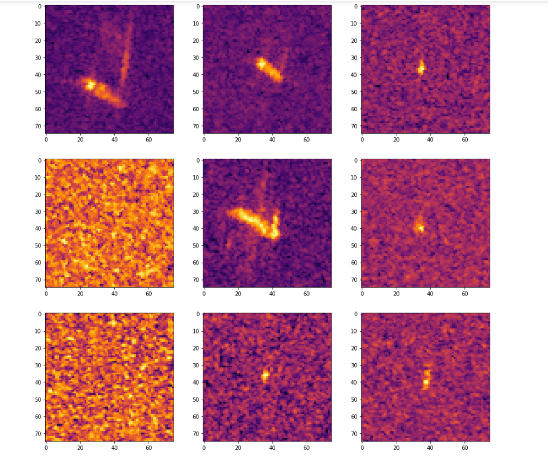

<i>Image of non-icebergs from Band_2</i>
  

<i>-</i>
  
Again, some of these images have higher background noise compared to band\_1. 

In order to minimize overfitting, we combine both band\_1, band\_2 and their average to generate a 3 channel image of the data.

### Algorithms and Techniques
<!-- In this section, you will need to discuss the algorithms and techniques you intend to use for solving the problem. You should justify the use of each one based on the characteristics of the problem and the problem domain. Questions to ask yourself when writing this section:
- _Are the algorithms you will use, including any default variables/parameters in the project clearly defined?_
- _Are the techniques to be used thoroughly discussed and justified?_
- _Is it made clear how the input data or datasets will be handled by the algorithms and techniques chosen?_ -->

I used Convolutional Neural Networks, which is the state-of-the-art algorithm for most of the image processing tasks out there. This algorithm takes images as input and then the data is fed through some layers of neurons including convolutional layers to generate output. In our case, we used a sigmoid layer at the end to generate a value from 0 to 1 which represents the probability. CNN has some parameters that can be tuned. These are following:

- number of epochs/number of training iterations
- karnel_size of each convolutional layer
- activation function of each convolutional layer
- pool_size of each pooling layer
- strides of each pooling layer
- optimizer function
- loss function
- metric function (used to judge the performance of the model)

Let's get more into how CNN works. CNN is a special type of neural networks that have convolutional layers. It serves a special purpose. A generic CNN architecture looks like this.   

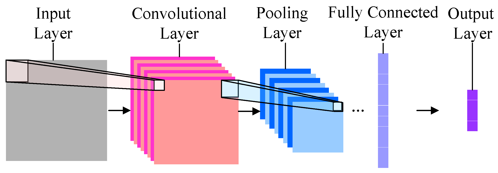

<i>CNN architecture</i>
  

<i>-</i>
  

In our case, we have multiple convolutional layers and pooling layers connected to them. What convolutional layer does is that slides a convolutional window over the image and then try to find patterns present in the image. Usually, it starts from top left and slides right and then after finishing the first row it goes down. Strides define how far the window should move while sliding. This small convolutional window gives an extra advantage, we do not have to put the object in the center of the image in order to identify correctly. The image could be anywhere in the image and the convolutional window will look for every part of the image and look for the pattern. In our case, we have a 75x75 pixel image that contains some object. Some of them contain icebergs and some of them do not. Our CNN takes the image as an input and with its convolutional layers, it looks for patterns in those images. Max pooling layers and dropout layers are added to prevent overfitting. In our case, with 4 convolutional layers, the model is able to find the patterns in the data to identify iceberg correctly.

### Benchmark
<!-- In this section, you will need to provide a clearly defined benchmark result or threshold for comparing across performances obtained by your solution. The reasoning behind the benchmark (in the case where it is not an established result) should be discussed. Questions to ask yourself when writing this section:
- _Has some result or value been provided that acts as a benchmark for measuring performance?_
- _Is it clear how this result or value was obtained (whether by data or by hypothesis)?_ -->

For benchmark model, I created a Convolutional Neural Network with only 1 convolutional layer, 1 dense layer. Finally, a sigmoid layer is added to generate output. This is a minimalistic CNN that can be used as a basic image classifier. With this model and 10 epochs, I have got minimum loss of 8.4681 with a validation accuracy of  0.4688.

## III. Methodology
<!-- _(approx. 3-5 pages)_ -->

### Data Preprocessing
<!-- In this section, all of your preprocessing steps will need to be clearly documented, if any were necessary. From the previous section, any of the abnormalities or characteristics that you identified about the dataset will be addressed and corrected here. Questions to ask yourself when writing this section:
- _If the algorithms chosen require preprocessing steps like feature selection or feature transformations, have they been properly documented?_
- _Based on the **Data Exploration** section, if there were abnormalities or characteristics that needed to be addressed, have they been properly corrected?_
- _If no preprocessing is needed, has it been made clear why?_ -->

First of all, We checked for any missing data especially in band\_1 and band\_2 as they are the features that we want to use. Fortunately, there was no missing data for both bands. In each image, the band\_1 and band\_2 has been flattened. So, we need to create 75x75 array from each band to represent them as images. With numpy we have created 75x75 array from each band. Then, we want to create an image that contains data from both bands. So, we created a 3 channel image with band 1 and band 2 as first two channels and their average as the third channel. Finally, I have created an array with dimension of 75x75x3 that represents each image in the dataset.

### Implementation
<!-- In this section, the process for which metrics, algorithms, and techniques that you implemented for the given data will need to be clearly documented. It should be abundantly clear how the implementation was carried out, and discussion should be made regarding any complications that occurred during this process. Questions to ask yourself when writing this section:
- _Is it made clear how the algorithms and techniques were implemented with the given datasets or input data?_
- _Were there any complications with the original metrics or techniques that required changing prior to acquiring a solution?_
- _Was there any part of the coding process (e.g., writing complicated functions) that should be documented?_ -->

The implementation process is divided into two parts. 
- Training the classifier
- Prediction

In order to train the classifier, a CNN model was trained on the preprocessed data. This is done in the Jupiter notebook titled "Iceberg Classifier". Let's get into further details.

1. Load both train and test data in the memory. Look for missing data.
2. To get a better understanding of the data some random data from the dataset are taken and plotted them for visualization.
3. Now, I defined the architecture of a CNN model that looks like following.  

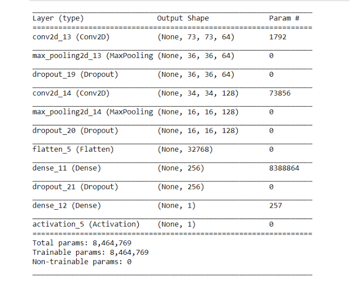

<i>CNN model for iceberg classification</i>
  

<i>-</i>
 

This architecture which is a sequential model has 2 convolutional layers each has kernel size of 3, a 'relu' activation function followed by a max pooling layer that has pool size of 2 and strides of 2. And then a dropout layer is added to drop 20% of the incoming flow. The first convolutional layer has 64 nodes and the second one has 128 nodes. After that, a flatten layer is added to flatten the data followed by a fully connected dense layer of 256 nodes. Again, a dropout layer is added to overcome overfitting. Finally, all the nodes are connected to a single dense layer and a sigmoid activation function.

4. A loss function is defined, in this case, "binary_crossentropy" loss function is used.
5. We used an Adam optimizer as the optimizer function with a learning rate of 0.001, beta\_1 of 0.9, beta\_2 of 0.999, epsilon value of 1e-08 and decay value of 0.
6. Finally, we compiled the model with a metric of 'accuracy'.
7. For training and validation we used a train_test_split function from sklearn to split the preprocessed data with a ratio of 0.75:0.25 for training and validation dataset. 
8. Now we fit the train data with the training label into the fit function with a batch size of 24 and epochs value of 10 and validate the data with the validation set in each epoch. Finally, we save the best performance into an hdf5 file. 

There have been some challenges regarding this process. The first one that I faced was how many convolutional layers should I use. As more layers mean more training time and more prone to overfitting. Fewer layers make the model not accurate at all. The way I overcame this is I started from the benchmark model and then increased the layers as long I was not satisfied with the result. Also, with all these hyperparameters that can be tuned sometimes, it becomes hard for one to decide how to tune them. In those cases, we should start from somewhere and then slowly tune the parameters to observe the changes in the result.  

### Refinement
<!-- In this section, you will need to discuss the process of improvement you made upon the algorithms and techniques you used in your implementation. For example, adjusting parameters for certain models to acquire improved solutions would fall under the refinement category. Your initial and final solutions should be reported, as well as any significant intermediate results as necessary. Questions to ask yourself when writing this section:
- _Has an initial solution been found and clearly reported?_
- _Is the process of improvement clearly documented, such as what techniques were used?_
- _Are intermediate and final solutions clearly reported as the process is improved?_ -->

In order to improve accuracy, I modified the CNN architecture. Previously we had 2 convolutional layers. We added 2 more convolutional layers and instead of 1 fully connected layers, we used 2 fully connected dense layers. The architecture looks following.   

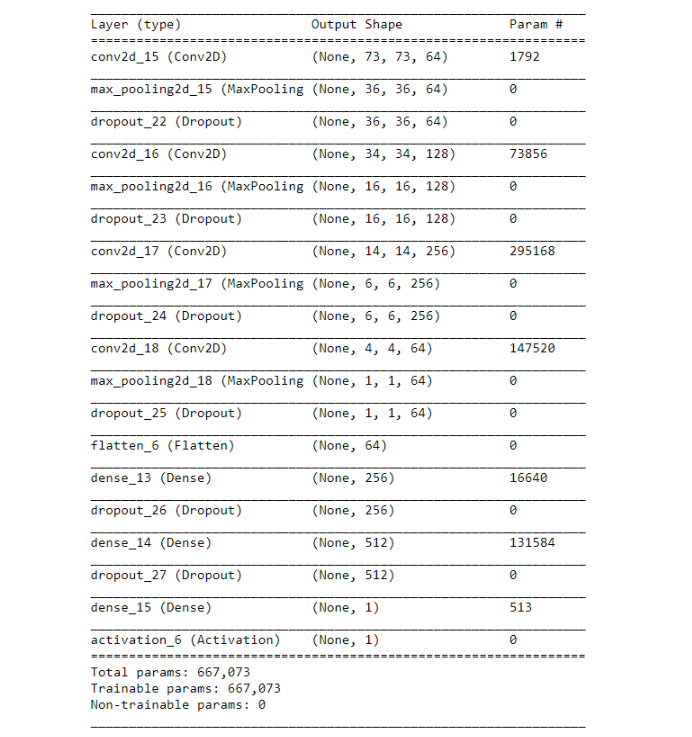

<i>Modified CNN model for iceberg classification</i>
  

<i>-</i>
 

As we added 2 more convolutional layers, the third one has 256 nodes with the same kernel size of 3, 'relu' activation function as before. The forth convolutional layer, however, has 64 nodes and all the other configure are same as others. Both of these new layers each have one max pooling layer with a pool size of 3 and strides of value 2 and a dropout layer with 20% dropout added to them. after these 3 convolutional layers, we flattened them and added two fully connected dense layers each with 'relu' activation function and a 20% dropout layer added next to them. The first dense layer has 256 nodes and the second one has 512 nodes. Finally, we added a dense layer with 1 node and added a 'sigmoid' function added to it. Also, during the architecture, we didn't change any configuration from before however we increased epochs from 10 to 50. 

## IV. Results
<!-- _(approx. 2-3 pages)_ -->

### Model Evaluation and Validation
<!-- In this section, the final model and any supporting qualities should be evaluated in detail. It should be clear how the final model was derived and why this model was chosen. In addition, some type of analysis should be used to validate the robustness of this model and its solution, such as manipulating the input data or environment to see how the model’s solution is affected (this is called sensitivity analysis). Questions to ask yourself when writing this section:
- _Is the final model reasonable and aligning with solution expectations? Are the final parameters of the model appropriate?_
- _Has the final model been tested with various inputs to evaluate whether the model generalizes well to unseen data?_
- _Is the model robust enough for the problem? Do small perturbations (changes) in training data or the input space greatly affect the results?_
- _Can results found from the model be trusted?_ -->

During the development process, a validation set was used from the train data. During fitting the model we used a loss function of 'binary_crossentropy' and 'accuracy' metrics that help us to evaluate the model. Let's analyze both the architecture that we have defined.

The first model that we created has 2 convolutional layers and a fully connected dense layer with dropout layers attached to them. As the test data is not labeled and we can not really anything about the test data so we relied on the validation data for evaluation. In this case, the lowest loss score we got is 8.3858 with a validation accuracy of 0.4681. Is this is a binary classification  0.4688 is not even a decent score as complete random prediction will give us roughly accuracy of 0.5. The result looks like following.
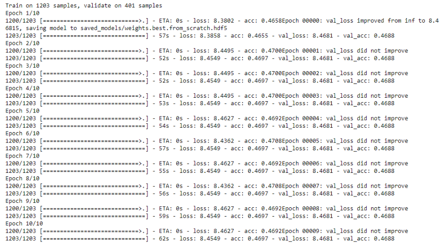

<i>Result of CNN model for iceberg classification</i>
  

<i>-</i>
 

For the **improved** architecture where we increased the number of layers and epochs, the result looks different. This model has 4 convolutional layers and 2 dense layers with a 1 node dense layer at the end with a sigmoid function. As usual, we fit the data and validate with the 25% validation set from the train data. Part of the 50 epochs result looks like following.   

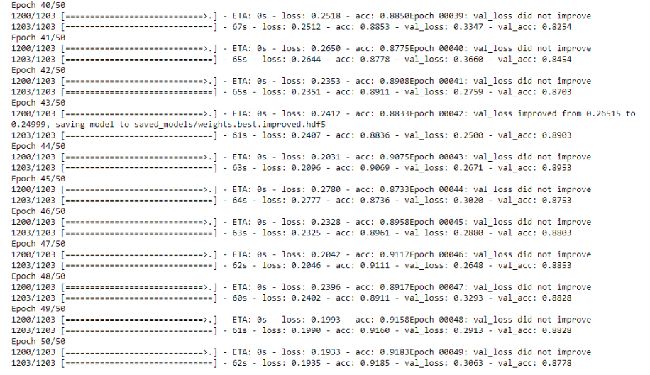

<i>Result of modified CNN model for iceberg classification</i>
  

<i>-</i>
 

In this case, we can see that the result improved significantly. We got the lowest validation loss score of 0.2499 and validation accuracy of 0.8953. So we can say that this model predicts the right answer almost 90% of the time on data that it has never seen before.   

According to the validation result, the model has a validation accuracy of 0.8953 which tells us that the model generalize well to unseen data as the training was done on train data and it never saw validation data before. It is yet to measure how the model performs to outliers however, with an validation accuracy of almost 90% I think this model is robust enough to be trusted.  

In order to measure the robustness of the model what I have done is I have taken 9 sample images from test dataset and then predicted their probability of containing an iceberg using out model. Then I have changed some particular number of pixel values in the images randomly to in between max and min value of that image. I have increased the number of changes to be made in the image and then plotted the result from each observation. I started with 0 number of pixel changes and then changed 50 number of pixels in the images. Continued it for 500,1000 and 2000 number of pixel changes. The plot looks like following.  

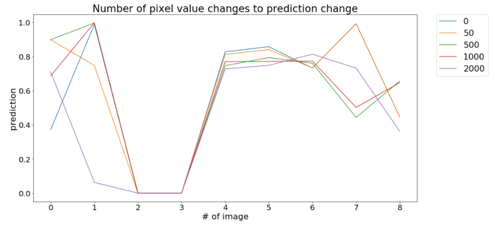

<i>Number of pixel value changes to prediction change</i>
  

<i>-</i>
  

Here, we can see that even after changing 2000 pixels values in the image out of 5626 pixels the model is still very consistent. Although some images have more consistency than others, however, the overall robustness seems decent.   

### Justification
<!-- In this section, your model’s final solution and its results should be compared to the benchmark you established earlier in the project using some type of statistical analysis. You should also justify whether these results and the solution are significant enough to have solved the problem posed in the project. Questions to ask yourself when writing this section:
- _Are the final results found stronger than the benchmark result reported earlier?_
- _Have you thoroughly analyzed and discussed the final solution?_
- _Is the final solution significant enough to have solved the problem?_ -->

In our benchmark model, we got a minimum loss of 8.4681 and a validation accuracy of 0.4688 which is very poor given that this is a binary classification problem and even with absolute random prediction we should get an accuracy of 0.5 on a large dataset. However, our benchmark did not do better than that. If we compare this to out improved CNN model with 4 convolutional layers then we can see that out improved model has a loss score of 0.2499 and validation accuracy of 0.8953. This is very impressive as almost 90% of the data is being predicted correctly from images that are sometimes difficult for humans to classify too. I think this solution is significant enough to solve the problem as almost 90% of the unseen data is predicted correctly. 

## V. Conclusion
<!-- _(approx. 1-2 pages)_ -->

### Free-Form Visualization
<!-- In this section, you will need to provide some form of visualization that emphasizes an important quality about the project. It is much more free-form, but should reasonably support a significant result or characteristic about the problem that you want to discuss. Questions to ask yourself when writing this section:
- _Have you visualized a relevant or important quality about the problem, dataset, input data, or results?_
- _Is the visualization thoroughly analyzed and discussed?_
- _If a plot is provided, are the axes, title, and datum clearly defined?_ -->

Let's look at some of the images from the test dataset and their predicted values.   

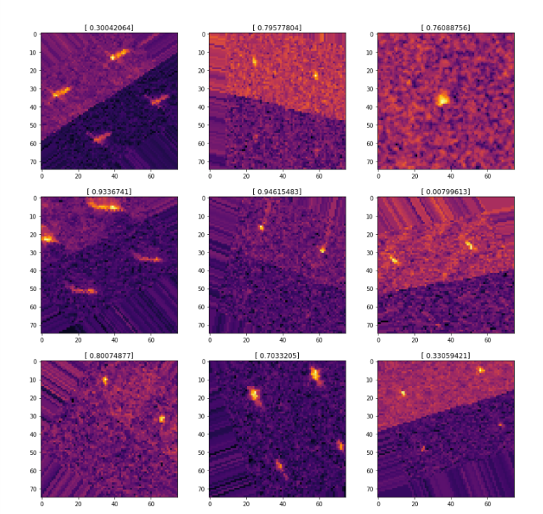

<i>Random images from test data with the corresponding prediction</i>
  

<i>-</i>
 

Each image in this plot is created with 3 channels containing band 1, band 2 and their average. And the corresponding value is the predicted probability of the image containing an iceberg. We can see most the images in this plot looks like an iceberg and their corresponding value is close to 1. The first image is predicted as not an iceberg and it looks more like a ship than iceberg.

### Reflection
<!-- In this section, you will summarize the entire end-to-end problem solution and discuss one or two particular aspects of the project you found interesting or difficult. You are expected to reflect on the project as a whole to show that you have a firm understanding of the entire process employed in your work. Questions to ask yourself when writing this section:
- _Have you thoroughly summarized the entire process you used for this project?_
- _Were there any interesting aspects of the project?_
- _Were there any difficult aspects of the project?_
- _Does the final model and solution fit your expectations for the problem, and should it be used in a general setting to solve these types of problems?_ -->

The object of this project was to successfully create a binary image classifier that can classify icebergs from other objects like ships or anything else. However, the interesting part was that although CNN is very effective in image classification, however, in this case, the input data was not really an image. It was actually the reflection of radar signals bounced off the surface and other objects like icebergs and ships. The input was preprocessed from a 75x75 pixel radar image to a flattened array. We reshaped them back into a 75x75 pixel image and then used CNN with multiple convolutional layers and dense layers to successfully classify icebergs. Even with only 1203 images used for training and 401 images to validate, the model did good achieving almost 90% accuracy. 

One of the most interesting aspect of this work was that it was a real world data that tends to solve a real world problem. The biggest challenge that I faced was where to start and what approach should I take to a certain problem. In this case, the idea of choosing CNN has been helpful. I learned how to build a CNN to solve an image classification problem from scratch, how to improve the performance by fine tuning the paramenters and think about further imrovement. 

### Improvement
<!-- In this section, you will need to provide discussion as to how one aspect of the implementation you designed could be improved. As an example, consider ways your implementation can be made more general, and what would need to be modified. You do not need to make this improvement, but the potential solutions resulting from these changes are considered and compared/contrasted to your current solution. Questions to ask yourself when writing this section:
- _Are there further improvements that could be made on the algorithms or techniques you used in this project?_
- _Were there algorithms or techniques you researched that you did not know how to implement, but would consider using if you knew how?_
- _If you used your final solution as the new benchmark, do you think an even better solution exists?_ -->

Although 90% is good enough with such a small train dataset however it could have been further improved. The number of convolutional layers could be increased to check if that gives a better performance. Moreover, the test data has been totally unused in this case. We could make a semi unsupervised model that could use the test dataset as well. For example, now that we have a model that classify with an accuracy of 90%, we could classify batch of images from test dataset and then put them in the training dataset to further improve the prediction accuracy of our model. I think that would make the accuracy even better.

-----------
<!-- 
**Before submitting, ask yourself. . .**

- Does the project report you’ve written follow a well-organized structure similar to that of the project template?
- Is each section (particularly **Analysis** and **Methodology**) written in a clear, concise and specific fashion? Are there any ambiguous terms or phrases that need clarification?
- Would the intended audience of your project be able to understand your analysis, methods, and results?
- Have you properly proof-read your project report to assure there are minimal grammatical and spelling mistakes?
- Are all the resources used for this project correctly cited and referenced?
- Is the code that implements your solution easily readable and properly commented?
- Does the code execute without error and produce results similar to those reported? -->
